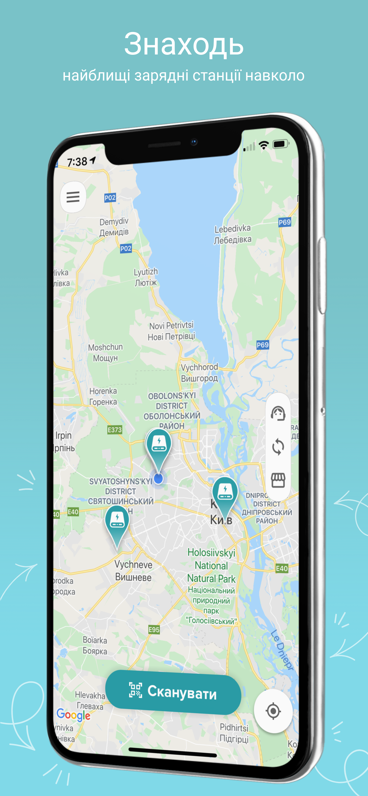
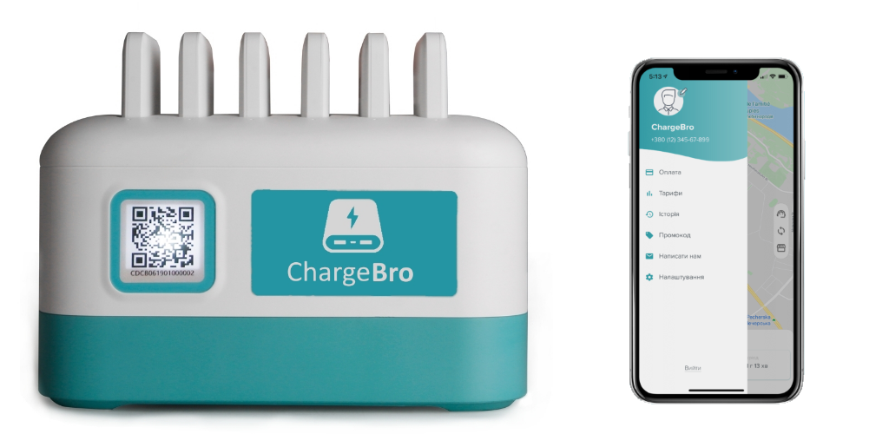

# ChargeBro Mobile App

<p align="center">
  
  &nbsp;&nbsp;&nbsp;&nbsp;
  
</p>

Cross-platform mobile application for powerbank sharing service, built with [Codename One](https://www.codenameone.com/).

> **Note:** This project was developed in 2019-2020 as part of a startup that is no longer active. The code is shared for educational purposes and as a portfolio piece.

## Features

- **Map View** - Find nearby charging stations using Google Maps integration
- **QR Code Scanning** - Scan station QR codes to rent powerbanks
- **User Authentication** - Phone number verification via SMS
- **Wallet & Payments** - In-app payment integration (Fondy)
- **Rental History** - Track past rentals and spending
- **Real-time Updates** - WebSocket connection for live station status
- **Multi-language** - Ukrainian localization support

## Tech Stack

- **Framework:** Codename One (Java)
- **Maps:** Google Maps API (iOS, Android, JavaScript)
- **QR Scanner:** ZBar library
- **Real-time:** WebSockets (cn1-websockets)
- **Build:** Ant/NetBeans

## Project Structure

```
src/
├── com/mykovol/takeandcharge/
│   ├── TakeAndChargeMain.java    # App entry point
│   ├── dataobj/                   # Data models (DTOs)
│   ├── form/                      # UI screens
│   │   ├── MainForm.java         # Map screen with stations
│   │   ├── LoginForm.java        # Phone authentication
│   │   ├── WalletForm.java       # Payment management
│   │   └── component/            # Reusable UI components
│   ├── service/                   # Business logic
│   │   ├── LocationService.java  # GPS handling
│   │   ├── RentService.java      # Rental operations
│   │   ├── UserService.java      # Auth & user data
│   │   └── WebSocketClient.java  # Real-time connection
│   └── tools/                     # Utilities
```

## Setup

1. Install [Codename One plugin](https://www.codenameone.com/download.html) for your IDE
2. Copy `codenameone_settings.properties.example` to `codenameone_settings.properties`
3. Fill in your credentials:
   - Google Maps API keys (Android, iOS, JavaScript)
   - iOS certificates and provisioning profiles
   - Android keystore
4. Open project in NetBeans/IntelliJ with CN1 plugin

## Building

```bash
# Using Ant
ant build

# Or use Codename One build servers via IDE plugin
```

## Backend

This app requires the [ChargeBro Backend](https://github.com/vladmykol/chargebro-backend) to function.

## License

This project is provided as-is for educational purposes. Feel free to use it as a reference for building similar applications.

## Author

Developed by [Vlad Mykol](https://vladmykol.com/) ([GitHub](https://github.com/vladmykol)) in 2019-2020.
